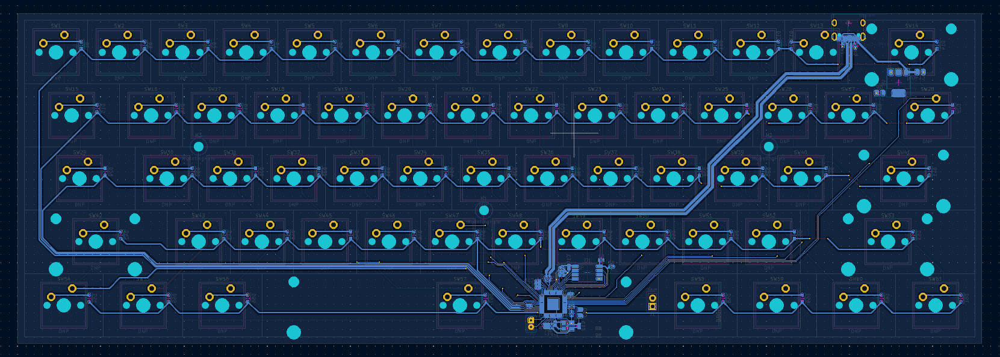
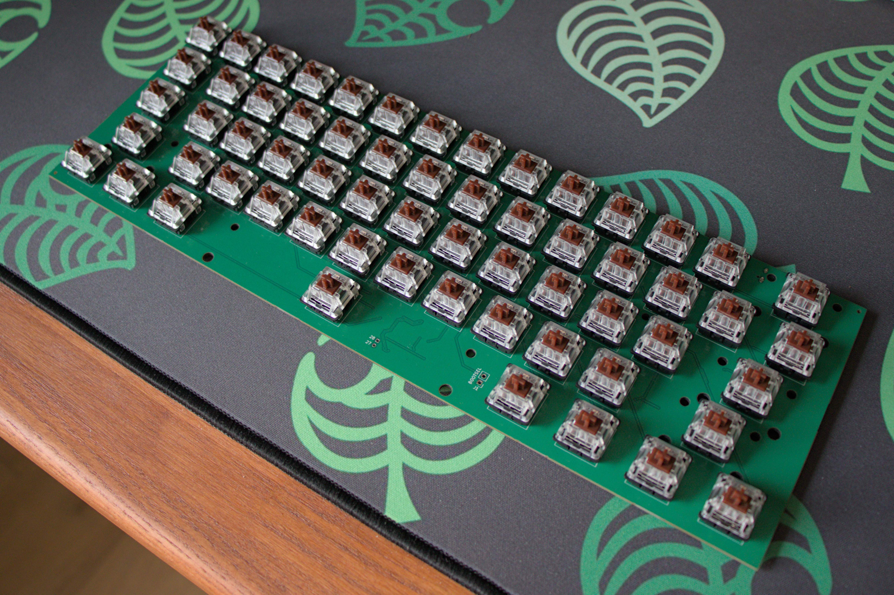
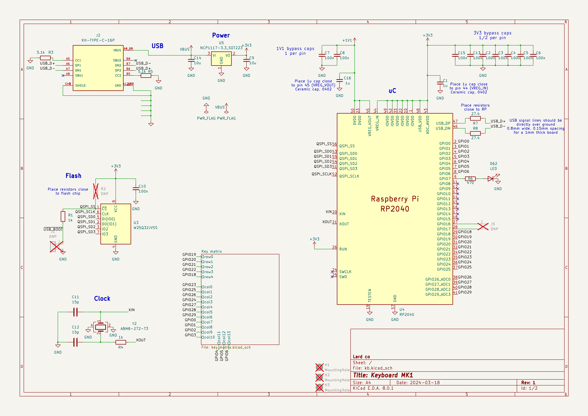

# lard61

A custom 60% ansi keyboard PCB.

+ [RP2040](https://www.raspberrypi.com/documentation/microcontrollers/rp2040.html)
+ 4MB flash
+ 12MHz crystal
+ USB-C
+ full n-key rollover
+ a single LED

